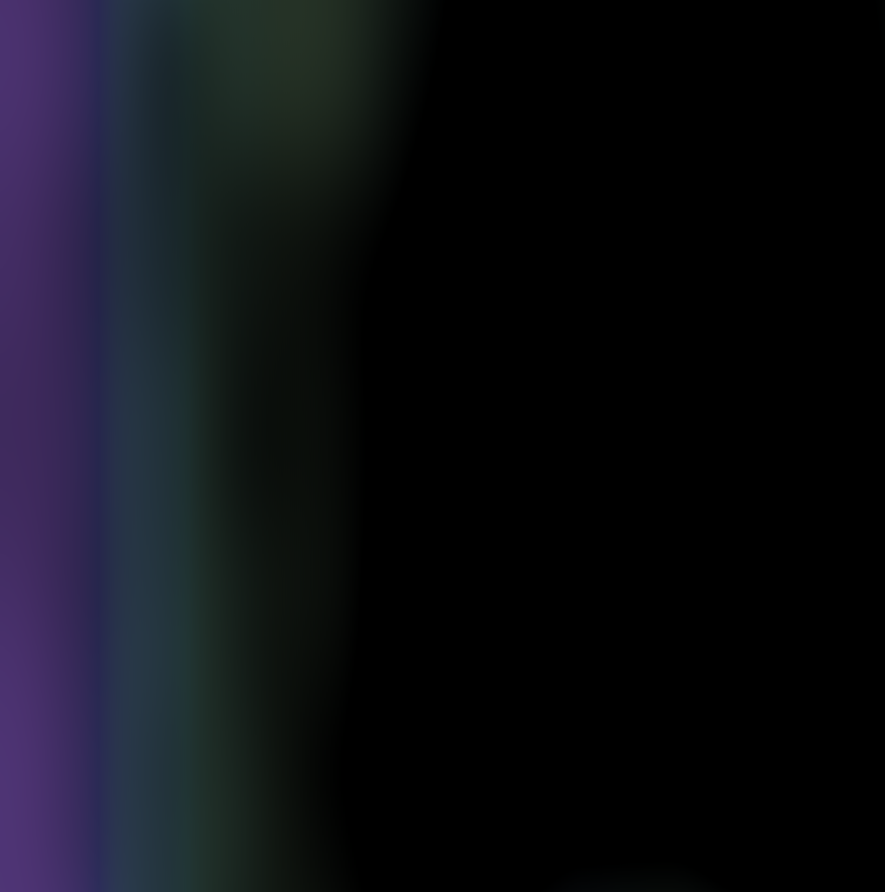
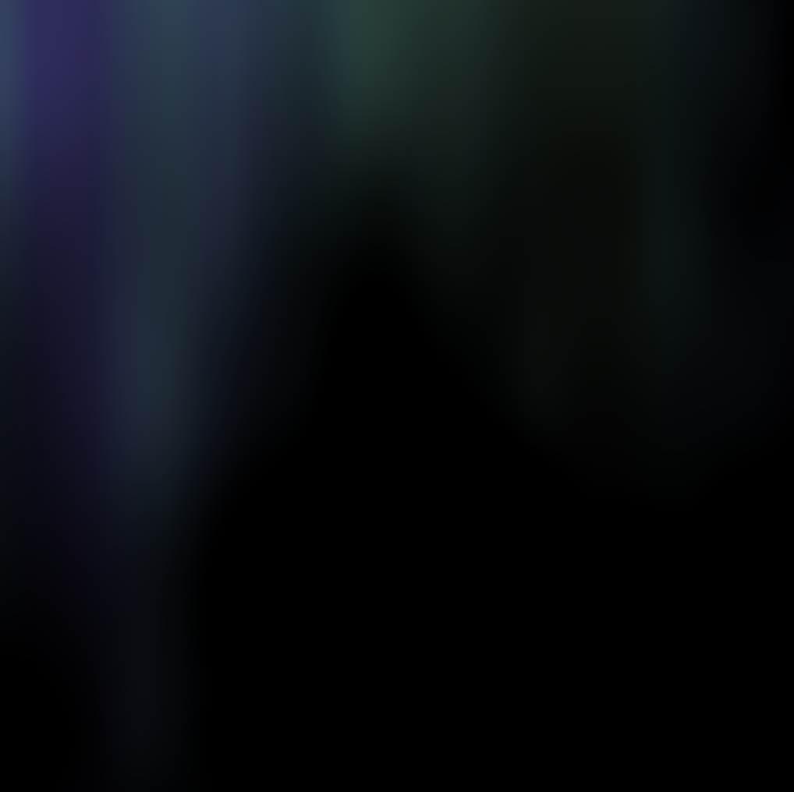
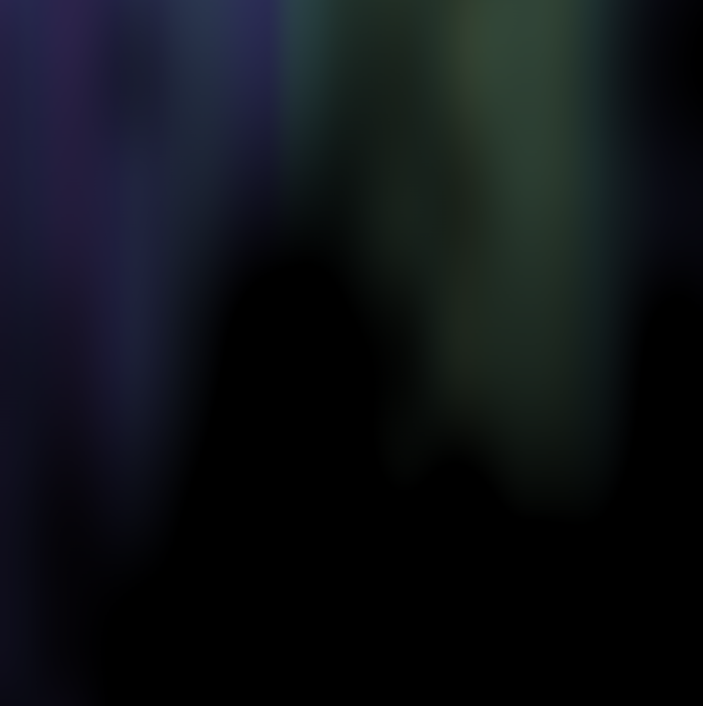

# Intro - Exercise I.9

> Add a third argument to noise that increments once per cycle through draw() to animate the two-dimensional noise.

[Link](http://natureofcode.com/book/introduction/#intro_exercise9)

